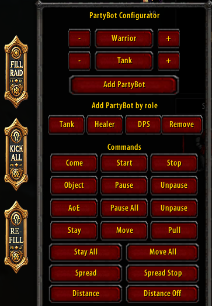
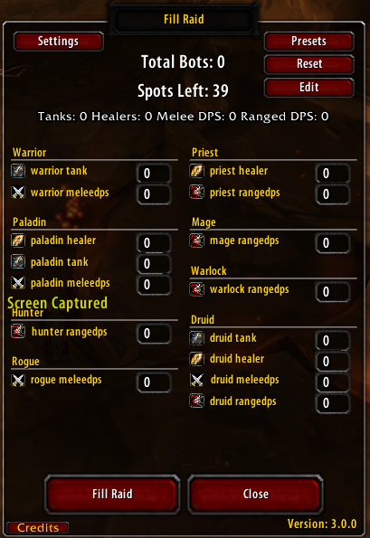
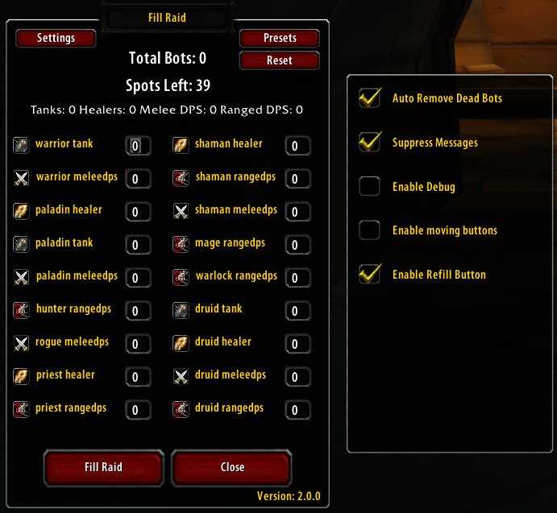

# FillRaidBots

## Overview

This addon is an extension for the **PartyBot Command Panel (PCP)** for **World of Warcraft (WoW) 1.12.1** helps users efficiently fill a raid with bots and manage them through an intuitive command panel. It includes features for setting up bot configurations, managing presets for various dungeons and raids, and automating bot removal.

## Features

- **Automated Interface Creation:**
   Automatically creates and opens the "Fill Raid" and "Kick All" buttons when the PartyBot Command Panel is accessed.
  

- **Fill Raid Button:**
  - Opens a frame where users can specify the number of bots they want to add.
  - Allows users to choose from predefined presets for various raid instances, simplifying setup.

- **Kick All Button:**
  - Removes all bots from the raid while keeping one bot to avoid disbanding the raid.
- **Refill Raid button:**
Replaces bots that die and are removed during gameplay.
- **Settings Menu:**
  - Provides options to enable automatic dead bot removal.
  - Allows users to suppress bot messages for a cleaner interface.

## Installation

1. **Download the Addon:** 
   - Clone this repository or download the ZIP file from GitHub.

2. **Extract Files:**
   - Extract the contents to your WoW addons directory, typically located at `World of Warcraft/Interface/AddOns`.
   - Rename the map FillRaidBots--main to FillRaidBots

3. **Enable the Addon:**
   - Launch WoW and go to the AddOns menu from the character select screen.
   - Ensure that the addon is enabled in the list.

## Usage

1. **Open the PartyBot Command Panel:**
   - The addon automatically creates and opens the "Fill Raid" and "Kick All" buttons.

2. **Configure the Raid:**
   - Click the "Fill Raid" button to open a configuration frame.
   - Set the number of bots for each role or use the "Presets" button to select from predefined raid setups.

3. **Apply Presets:**
   - Use the preset options to quickly fill the raid with optimized configurations for different dungeons and raids.

4. **Kick All Bots:**
   - Click the "Kick All" button to remove all bots from the raid, ensuring that at least one bot remains to prevent disbanding.

5. **Refill Raid button:**
Replaces bots that die and are removed during gameplay.

6. **Adjust Settings:**
   - Access the settings menu to enable automatic dead bot removal and suppress bot messages as needed.

## Presets

The addon includes optimized presets for several dungeons and raids:

- **Onyxia:** 2 warrior tanks, 2 paladin healers, rest mages.
- **Molten Core (MC):** Detailed presets for each boss, including tanks, healers, and DPS roles.
- **AQ20:** Various presets for different bosses.
- **Zul'Gurub (ZG):** Specific presets for each boss, including tanks, healers, and DPS roles.
- **Blackwing Lair (BWL) and AQ40:** Configurations for raid encounters.

## Editing Presets or Suppress bot messages
- **SuppressBotMsg.lua** edit this file to add or change how often a message should be displayed
- **Presets.lua** edit this file to add or change a preset

## Changelog

**Fillraidbots 2.0.0**

    🆕 Added: A debugger window for when debugging is enabled. All debug messages are now sent here instead of cluttering the chat window.
    🆕 Added: A version checker that notifies you if a newer version of the addon is available.
    🆕 Added: Logic to distribute healers evenly across the raid when bots are added.
    🆕 Added: Class and role detection in the raid, enabling new functionality such as managing bots based on their roles.
    🆕 Added: A new "Refill Raid" button, which replaces bots that die and are removed during gameplay.
    🛠 Fixed: The /uninviteraid slash handler to prevent conflicts with WoW's native commands like /kick and /uninvite, which were unintentionally uninviting the entire raid. (Reported by Gemma)
    🔄 Version updated: From 1.2.0 to 2.0.0, marking this as a major update due to significant new features and functionality improvements.

**Fillraidbots 1.2.0**

    🛠 Fixed: Since the latest server update, which prevents adding bots while in combat, an issue occurred where adding certain bots, such as warriors or hunters, caused you to enter combat for a few seconds. This created a problem where the addon attempted to add bots when they couldn't be added. I have now fixed it so that the addon detects when you're in combat and pauses until you're out of combat.

    🛠 Added: The ability to move the 'fill raid' and 'kick all' buttons if this is enabled in the settings."

    🛠 Added: A version number to the FillRaidFrame so that it's easier to see which version you're using.

    🔄 Version updated: Incremented from 1.1.0 to 1.2.0 to reflect both the addition of new features (movable buttons and visible version number) and the resolution of a bug related to combat behavior. This update introduces functional improvements while maintaining backward compatibility.

**Fillraidbots 1.1.0**

    🛠 Added: : Checks if you are in a raid and there is still 1 old bot remaining. Removes the old bot when there are 10 new bots in the raid.

    🛠 Added: : If you are playing with someone else and are not the leader or an officer, the "remove bot" function is disabled.

    🔄 Version updated: From 1.0.0 to 1.1.0, indicating bug fixes.
## License

This project is licensed under the MIT License. See the [LICENSE](LICENSE) file for details.

## Contact

For any questions or issues, please open an issue on GitHub or contact the repository owner.
